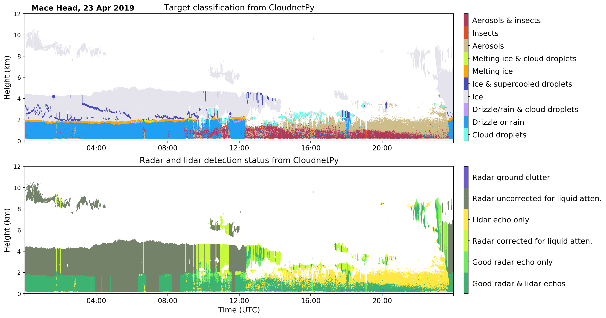

# CloudnetPy


[](https://cloudnetpy.readthedocs.io/en/latest/?badge=latest)
[](https://badge.fury.io/py/cloudnetpy)
[](https://zenodo.org/badge/latestdoi/233602651)
[](https://joss.theoj.org/papers/959971f196f617dddc0e7d8333ff22b7)

CloudnetPy is a Python software for producing vertical profiles of cloud properties from ground-based 
remote sensing measurements. The Cloudnet processing combines cloud radar, optical lidar, microwave 
radiometer and model data. Measurements and model data are brought into common grid and 
classified as ice, liquid, aerosol, insects, and so on. 
Then, geophysical products such as ice water content can be 
retrieved in the further processing steps. See [Illingworth et. al. (2007)](https://doi.org/10.1175/BAMS-88-6-883) for more details about the concept.

CloudnetPy is a rewritten version of the original Cloudnet Matlab code. CloudnetPy features several revised methods, extensive documentation, and more.

* CloudnetPy documentation: https://cloudnetpy.readthedocs.io/en/latest/
* Cloudnet data portal: https://cloudnet.fmi.fi



## Installation

### From PyPI
```
$ python3 -m pip install cloudnetpy
```

### From the source
```
$ git clone https://github.com/actris-cloudnet/cloudnetpy
$ cd cloudnetpy/
$ python3 -m venv venv
$ source venv/bin/activate
(venv) $ python3 -m pip install .
```
## Citing
If you wish to acknowledge CloudnetPy in your publication, please cite:
>Tukiainen et al., (2020). CloudnetPy: A Python package for processing cloud remote sensing data. Journal of Open Source Software, 5(53), 2123, https://doi.org/10.21105/joss.02123

## Contributing

We encourage you to contribute to CloudnetPy! Please check out the [contribution guidelines](CONTRIBUTING.md) about how to proceed.

## License
MIT
