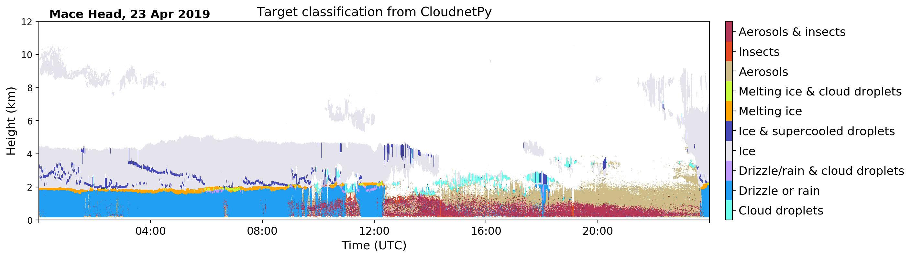

# CloudnetPy

[](https://travis-ci.org/tukiains/cloudnetpy)
[](https://cloudnetpy.readthedocs.io/en/latest/?badge=latest)
[](https://badge.fury.io/py/cloudnetpy)
[](https://doi.org/10.5281/zenodo.3529512)

CloudnetPy is a Python software for producing vertical profiles of cloud properties from ground-based remote sensing measurements. The Cloudnet processing combines cloud radar, optical lidar, microwave radiometer and model data. The measurements and model data are brought into common grid and classified as ice, liquid, aerosol, insects, and so on. Then, geophysical products such as ice water content can be retrieved in further processing steps.

CloudnetPy is a refactored fork of the currently operational (Matlab) processing code. The Python version features several revised methods, extensive documentation, and more.

* CloudnetPy documentation: https://cloudnetpy.readthedocs.io/en/latest/
* Cloudnet website: http://devcloudnet.fmi.fi



Installation
------------

CloudnetPy can be installed from the Python Package Index, PyPI, using pip:
```
$ pip3 install cloudnetpy
```

Contributing
------------

We encourage you to contribute to CloudnetPy! Please check out the [contribution guidelines](CONTRIBUTING.md) about how to proceed.
