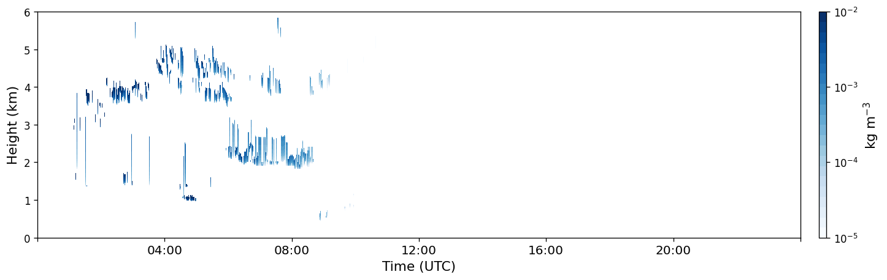
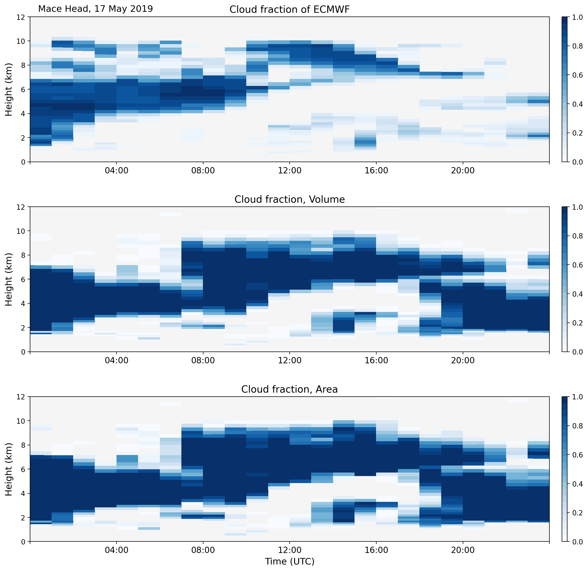

================
Model evaluation
================

CloudnetPy has work-in-progress model evaluation functionality. It aims to
connect Cloudnet observation products with simulation products from various
models and compare those. The main goal of the system is to point out
capability and lacks of different simulated cloud variables.

Model evaluation analysis will be done with several different time scales. The shortest
and the most important products are day scale downsampled products.
The day scale products are not jet the model evaluation products, but day scale
is the key step to create evaluation analysis between observations and model simulations.
At a later state of software developing also time length of month, season, year and decade
will be created based on day scale products.

Example chain of Model evaluation day scale processing of Cloud fraction, Ice water content and
Liquid water content.

.. figure:: _figs/20190517_mace-head_classification.png
          :width: 500 px
          :align: center

          Cloudnet L2 product 'Classification'. It is generated by using Cloudnet Categorize bits.
          Same bits are used for generating 'observed' Cloud fraction, which can't be observed.
          Cloud fraction is a post-process variable of models.

.. figure:: _figs/20190517_mace-head_iwc-Z-T-method.png
          :width: 500 px
          :align: center

          Cloudnet L2 product 'Ice water content'. Models are not producing exact the same variable but
          mixing ration of ice at grid point.
          Comparable product is calculated using temperature, pressure and moisture from model.

          Cloudnet L2 product 'Liquid water content'. Models are not producing exact the same variable but
          mixing ration of liquid at grid point.
          Comparable product is calculated using temperature, pressure and moisture from.

Time-height grid of observation products is always thicker than grid of models so
observation data is downsampled by averaging to be same size as model grid.
Downsampled observation and simulations are L3 day scale products.

Examples of L3 day products: model simulation vs. downsampled observation comparisons
of Cloud fraction, IWC and LWC.

          Observated and simulated Cloud fraction. Used model ECMWF.

.. figure:: _figs/20190517_mace-head_iwc_ecmwf_group.png
          :width: 500 px
          :align: center

          Observated and simulated IWC. Used model ECMWF.

.. figure:: _figs/20190517_mace-head_lwc_ecmwf_group.png
          :width: 500 px
          :align: center

          Observated and simulated LWC. Used model ECMWF.

For ensuring the most suitable version of observation downsampling, there are couple version
of specific products. For all products there is down sample to height-advection time grid version.
For cloud fraction there is couple different methods for generating observation and
also high level cloud filtered version. For IWC there is different masked versions.

Example of Model evaluation Workflow chart

.. figure:: _figs/L3_process.png
          :width: 500 px
          :align: center

See also:

- Cloudnet data portal: https://cloudnet.fmi.fi/
- ACTRIS home: http://actris.eu/
- ACTRIS data portal: http://actris.nilu.no/
