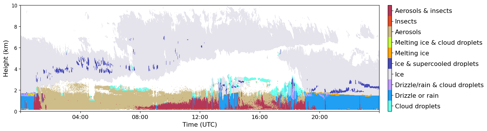
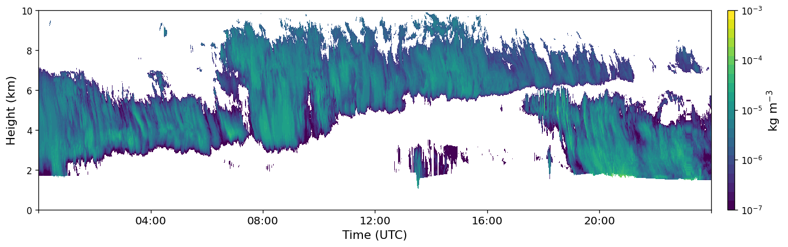
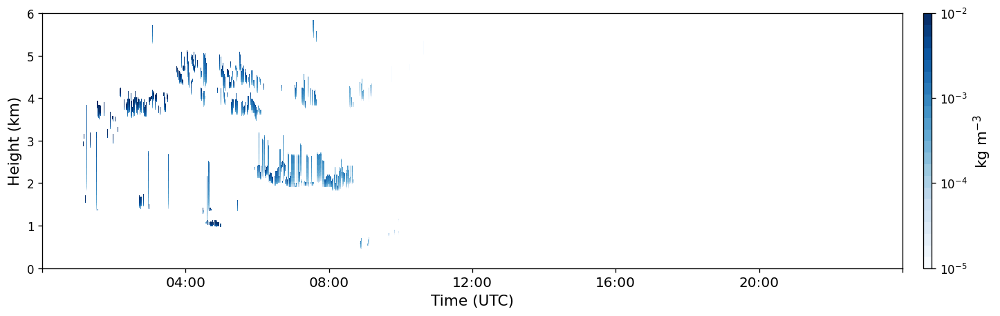
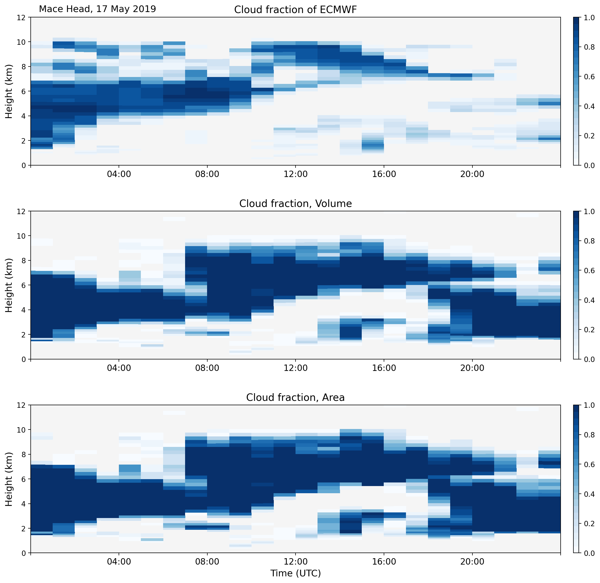
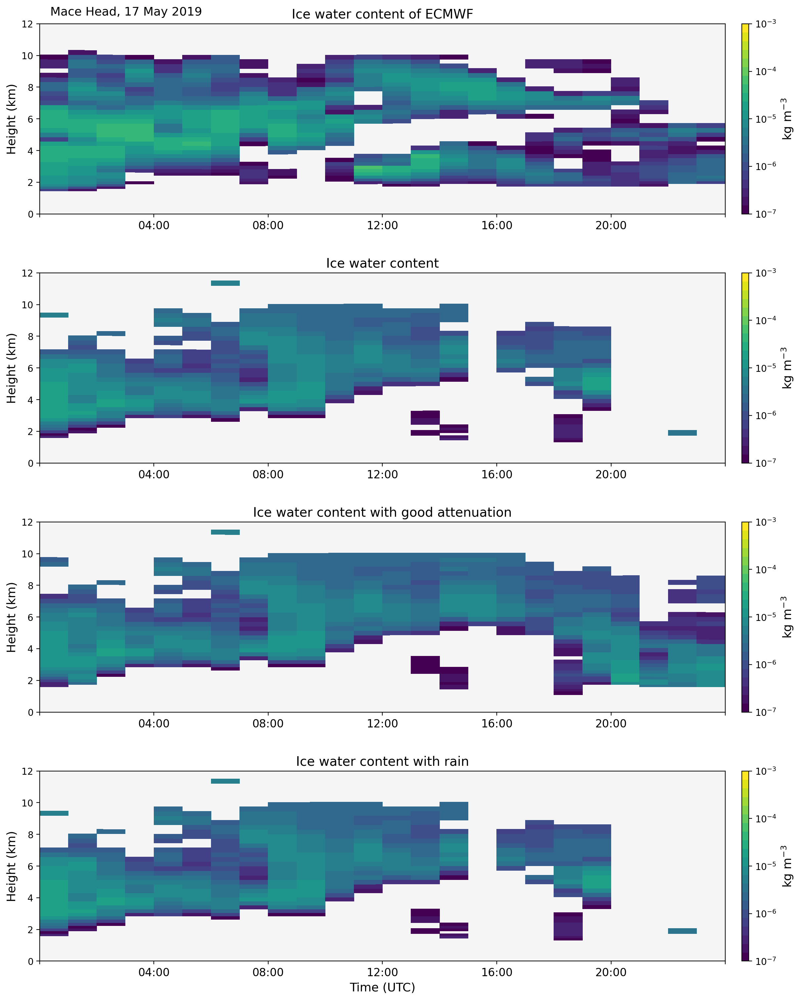
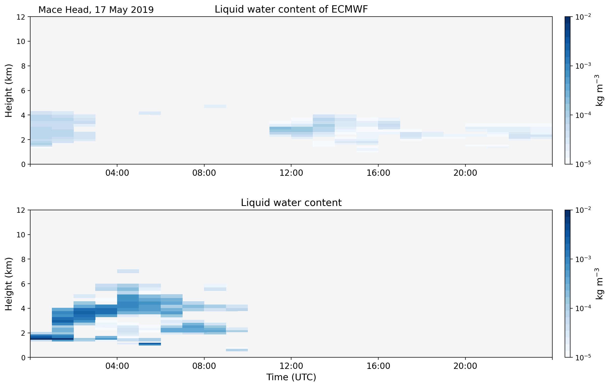
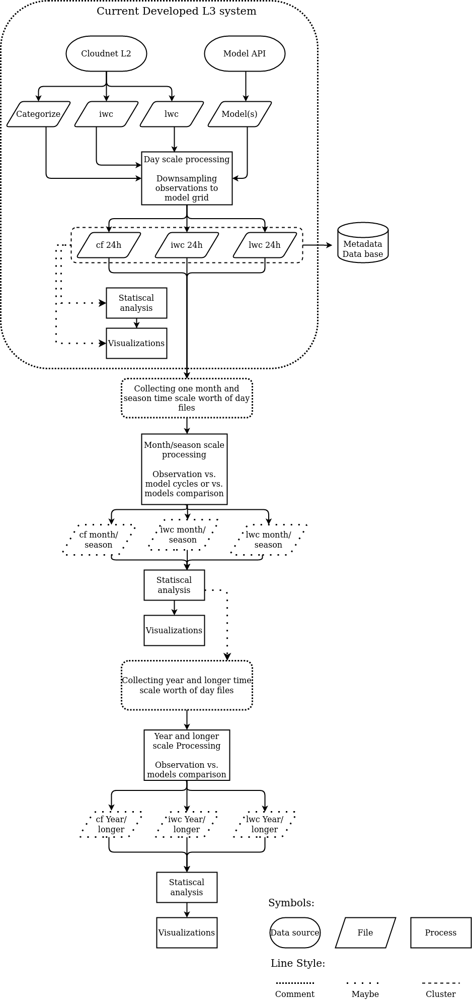

================
Model evaluation
================

CloudnetPy has work-in-progress model evaluation functionality. It aims to
connect Cloudnet observation products with simulation products from various
models and compare them. The main goal of the system is to highlight the
capabilities and shortcomings of different simulated cloud variables.

Model evaluation analysis will be done with several different time scales. The shortest
and the most important products are day scale downsampled products.
The day scale products are not yet the model evaluation products, but day scale
is the key step to create evaluation analysis between observations and model simulations.
At a later state of software development, time scales of month, season, year and decade
will also be created based on the day scale products.

Example chain of Model evaluation day scale processing of Cloud fraction, Ice water content and
Liquid water content.

          Cloudnet L2 product 'Classification'. It is generated by using Cloudnet Categorize bits.
          The same bits are used for generating an 'observed' Cloud fraction, since Cloud fraction
          itself cannot be observed directly. Cloud fraction is a post-processed variable of models.

          Cloudnet L2 product 'Ice water content'. Models do not produce exactly the same variable;
          they output the mixing ratio of ice at each grid point. A comparable product is calculated
          using temperature, pressure and moisture from the model.

          Cloudnet L2 product 'Liquid water content'. Models do not produce exactly the same variable;
          they output the mixing ratio of liquid at each grid point. A comparable product is calculated
          using temperature, pressure and moisture from the model.

The time-height grid of observation products is always finer than the grid of the models, so
observation data is downsampled by averaging to match the model grid.
Downsampled observations and simulations are L3 day scale products.

Examples of L3 day products: model simulation vs. downsampled observation comparisons
of Cloud fraction, IWC and LWC.

          Observed and simulated Cloud fraction. Used model ECMWF.

          Observed and simulated IWC. Used model ECMWF.

          Observed and simulated LWC. Used model ECMWF.

To ensure the most suitable observation downsampling, there are several versions of each
specific product. For all products there is a downsampled version on the height-advection
time grid. For cloud fraction there are several methods for generating the observation and
also a high-level-cloud-filtered version. For IWC, there are different masked versions.

Example of Model evaluation Workflow chart

See also:

- Cloudnet data portal: https://cloudnet.fmi.fi/
- ACTRIS home: http://actris.eu/
- ACTRIS data portal: http://actris.nilu.no/
