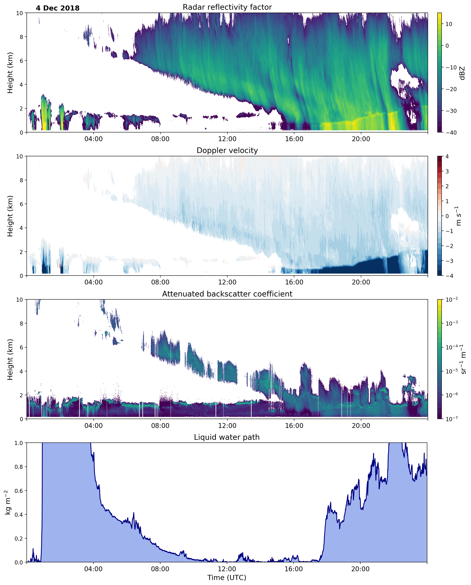
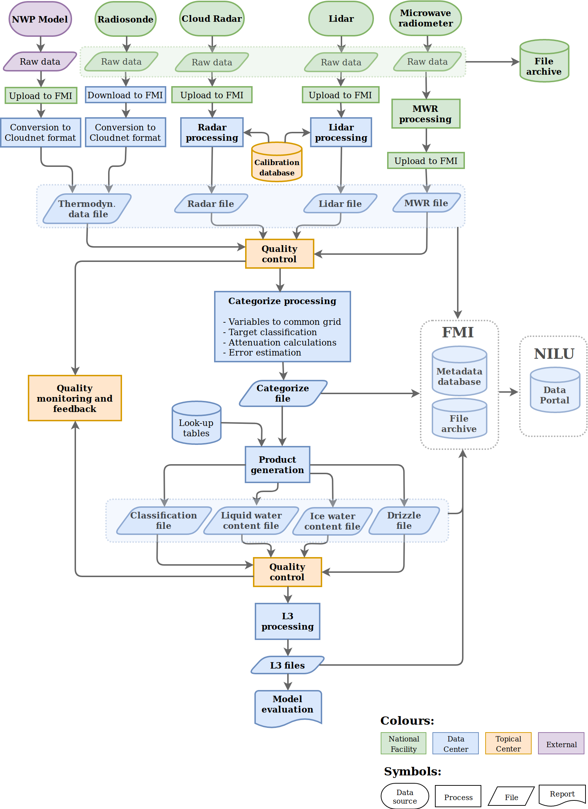

========
Overview
========

Cloudnet processing scheme
--------------------------

CloudnetPy (`Tukiainen 2020`_) is a Python package implementing the so-called Cloudnet processing scheme
(`Illingworth 2007`_). Cloudnet processing produces vertical profiles of cloud properties
from the ground-based remote sensing measurements. Cloud radar, optical lidar, microwave radiometer
and thermodynamical (model or radiosonde) data are combined to accurately characterize
clouds up to 15 km with high temporal and vertical resolution.

           Example of input data used in Cloudnet processing: Radar reflectivity factor (top), mean
           doppler velocity (2nd), lidar backscatter coefficient (3rd),
           and liquid water path from microwave radiometer (bottom).

The measurement and model data are brought into common grid and classified as ice,
liquid, aerosol, insects, and so on. Then, geophysical products such as ice water content
can be retrieved in further processing steps. A more detailed description can be
found in `Illingworth 2007`_ and references in it.

.. note::

    Near real-time Cloudnet data can be accessed at https://cloudnet.fmi.fi.

Statement of need
-----------------

In the forthcoming years, Cloudnet will be one of the key components in `ACTRIS`_ (Aerosol,
Clouds and Trace Gases Research Infrastructure), where the Cloudnet framework will be used
to process gigabytes of cloud remote sensing data per day in near real time. The ACTRIS
RI is now in its implementation phase and aims to be fully operational in 2025.

To fulfill requirements from ACTRIS, a robust, open software that can reliably process
large amounts of data is needed. The CloudnetPy software package is aimed to perform operational
ACTRIS cloud remote sensing processing, providing quality controlled data products from
around 15 measurement sites in Europe. Unlike the original proprietary Cloudnet software,
CloudnetPy is open source and includes tests, documentation and user-friendly API that
the research community can use to further develop the existing methods and to create
new products.

.. _Tukiainen 2020: https://doi.org/10.21105/joss.02123
.. _Illingworth 2007: https://journals.ametsoc.org/doi/abs/10.1175/BAMS-88-6-883
.. _ACTRIS: http://actris.eu/

.. important::

   CloudnetPy is a rewritten Python implementation of the original Matlab processing prototype code.
   CloudnetPy features several revised methods and bug fixes, open source codebase,
   netCDF4 file format and extensive documentation.

Operational Cloudnet processing will have CloudnetPy in its core but additionally include a
calibration database and comprehensive quality control / assurance procedures:

           Workflow of operational Cloudnet processing in ACTRIS.

See also:

- Cloudnet data portal: https://cloudnet.fmi.fi/
- CloudnetPy source: https://github.com/actris-cloudnet/cloudnetpy
- ACTRIS home: http://actris.eu/
- ACTRIS data portal: http://actris.nilu.no/
