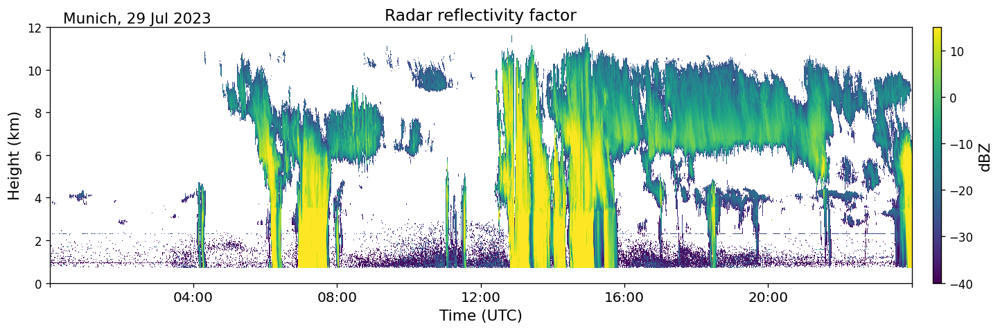
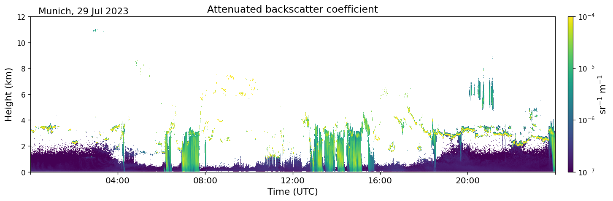
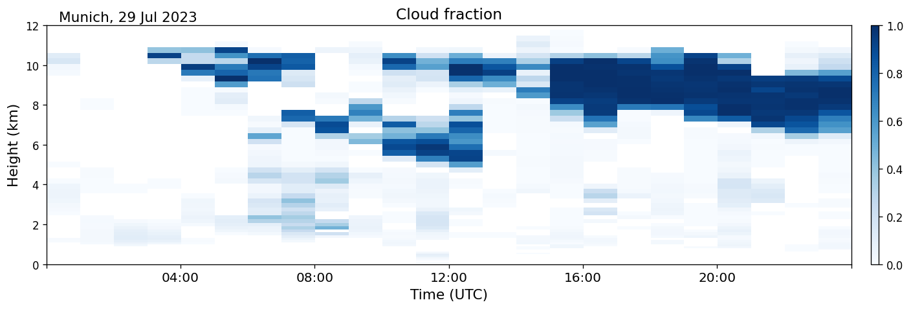
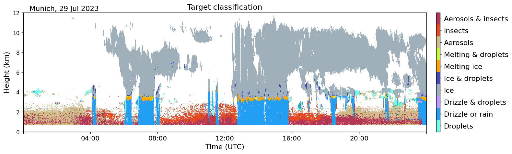

==========
Quickstart
==========

In this tutorial products are created from raw data using CloudnetPy's high level API.

Raw data conversion
-------------------

Before we can generate Cloudnet products, we need to convert raw instrument data to Cloudnet Level 1b netCDF files.
Let's start with the following raw files from `Munich <https://cloudnet.fmi.fi/site/munich>`_ site:

- METEK MIRA cloud radar: `20230729_0000.mmclx.gz <https://cloudnet.fmi.fi/api/download/raw/62905a7c-4e18-474f-8532-bb59f39ca4ff/20230729_0000.mmclx.gz>`_ (decompress before use)
- Lufft CHM 15k ceilometer: `CHM15kxLMU_20230729.nc <https://cloudnet.fmi.fi/api/download/raw/7d1909f3-c73f-4de9-a771-e6795751e495/CHM15kxLMU_20230729.nc>`_
- RPG HATPRO microwave radiometer: `230729.LWP <https://cloudnet.fmi.fi/api/download/raw/490704b2-7533-4137-979b-f197a6c72e17/230729.LWP>`_
- ECMWF model: `20230729_munich_ecmwf.nc <https://cloudnet.fmi.fi/api/download/product/856b5a84-155b-427d-b914-09238c206c02/20230729_munich_ecmwf.nc>`_

On Linux and macOS these files can be downloaded using the following commands:

.. code-block:: console

    curl -O https://cloudnet.fmi.fi/api/download/raw/62905a7c-4e18-474f-8532-bb59f39ca4ff/20230729_0000.mmclx.gz
    gunzip 20230729_0000.mmclx.gz
    curl -O https://cloudnet.fmi.fi/api/download/raw/7d1909f3-c73f-4de9-a771-e6795751e495/CHM15kxLMU_20230729.nc
    curl -O https://cloudnet.fmi.fi/api/download/raw/490704b2-7533-4137-979b-f197a6c72e17/230729.LWP
    curl -O https://cloudnet.fmi.fi/api/download/product/856b5a84-155b-427d-b914-09238c206c02/20230729_munich_ecmwf.nc

More raw files can be found using `Cloudnet data portal API <https://docs.cloudnet.fmi.fi/api/data-portal.html#get-apiraw-files--upload>`_.

Radar processing
~~~~~~~~~~~~~~~~

In the first example we convert a raw METEK MIRA-36 cloud radar file into
Cloudnet netCDF file that can be used in further processing steps.

.. code-block:: python

    from cloudnetpy.instruments import mira2nc
    uuid = mira2nc('20230729_0000.mmclx', 'radar.nc', {'name': 'Munich'})

Variable ``uuid`` contains an unique identifier for the generated ``radar.nc`` file.
For more information, see `API reference <api.html#instruments.mira2nc>`__ for this function.

You can plot variables such as radar reflectivity factor from the newly generated file.

.. code-block:: python

    from cloudnetpy.plotting import generate_figure
    generate_figure('radar.nc', ['Zh'])

Lidar processing
~~~~~~~~~~~~~~~~

Next we convert a raw Lufft CHM 15k ceilometer (lidar) file into Cloudnet netCDF file
and process the signal-to-noise screened backscatter coefficient. Also this converted lidar
file will be needed later.

.. code-block:: python

    from cloudnetpy.instruments import ceilo2nc
    uuid = ceilo2nc('CHM15kxLMU_20230729.nc', 'lidar.nc', {'name': 'Munich', 'altitude': 538})

Variable ``uuid`` contains an unique identifier for the generated ``lidar.nc`` file.
For more information, see `API reference <api.html#instruments.ceilo2nc>`__ for this function.

You can plot variables such as attenuated backscatter coefficient from the newly generated file.

.. code-block:: python

    generate_figure('lidar.nc', ['beta'])

MWR processing
~~~~~~~~~~~~~~

Next we convert RPG-HATPRO microwave radiometer (MWR) binary files (e.g. \*.LWP) into Cloudnet
netCDF file to retrieve integrated liquid water path (LWP).

.. code-block:: python

    from cloudnetpy.instruments import hatpro2nc
    uuid, valid_files = hatpro2nc('.', 'mwr.nc', {'name': 'Munich', 'altitude': 538}, date='2023-07-29')

Variable ``uuid`` contains an unique identifier for the generated ``mwr.nc`` file and `valid_files` contains which files were used for the processing.
For more information, see `API reference <api.html#instruments.hatpro2nc>`__ for this function.

You can plot variables such as liquid water path from the newly generated file.

.. code-block:: python

    generate_figure('mwr.nc', ['lwp'])

.. figure:: _static/quickstart_mwr.png

.. note::

    Separate MWR instrument is not required if you have a 94 GHz RPG cloud radar.
    RPG radars contain a single MWR channel providing LWP measurements, which can be
    used in CloudnetPy. Nevertheless, it is always recommended to equip a measurement site
    with a dedicated multi-channel radiometer if possible.

Model data
~~~~~~~~~~

Model files needed in the next processing step can be downloaded
from the `Cloudnet data portal API <https://docs.cloudnet.fmi.fi/api/data-portal.html#get-apimodel-files--modelfile>`_.
Several models may be available depending on the site and date.
The list of different model models can be found `here <https://cloudnet.fmi.fi/api/models/>`_.

You can plot variables such as cloud fraction from the model file.

.. code-block:: python

    generate_figure('20230729_munich_ecmwf.nc', ['cloud_fraction'])

Product generation
------------------

After processing the raw radar, lidar and MWR files, and acquiring
a model file, Cloudnet products can be created.

Categorize processing
~~~~~~~~~~~~~~~~~~~~~

In the next example we create a categorize file starting from the
``radar.nc``, ``mwr.nc`` and ``lidar.nc`` files generated above. The required
``20230729_munich_ecmwf.nc`` file can be downloaded from the top of this page.

.. code-block:: python

    from cloudnetpy.categorize import generate_categorize
    input_files = {
        'radar': 'radar.nc',
        'lidar': 'lidar.nc',
        'model': '20230729_munich_ecmwf.nc',
        'mwr': 'mwr.nc'
    }
    uuid = generate_categorize(input_files, 'categorize.nc')

Variable ``uuid`` contains an unique identifier for the generated ``categorize.nc`` file.
For more information, see `API reference <api.html#categorize.generate_categorize>`__ for this function.
Note that with a 94 GHz RPG cloud radar, the ``radar.nc`` file can be used as input
for both inputs: ``'radar'`` and ``'mwr'``.

Classification processing
~~~~~~~~~~~~~~~~~~~~~~~~~

In the last example we create the smallest and simplest Cloudnet
product, the classification product. The product-generating functions always
use a categorize file as an input.

.. code-block:: python

    from cloudnetpy.products import generate_classification
    uuid = generate_classification('categorize.nc', 'classification.nc')

Variable ``uuid`` contains an unique identifier for the generated ``classification.nc`` file.
Corresponding functions are available for other products
(see :ref:`Product generation`).

You can plot variables such as target classification from the newly generated file.

.. code-block:: python

    generate_figure('classification.nc', ['target_classification'])

