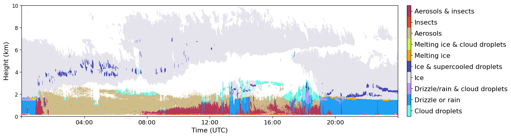
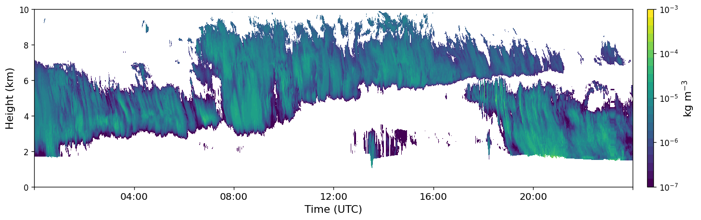
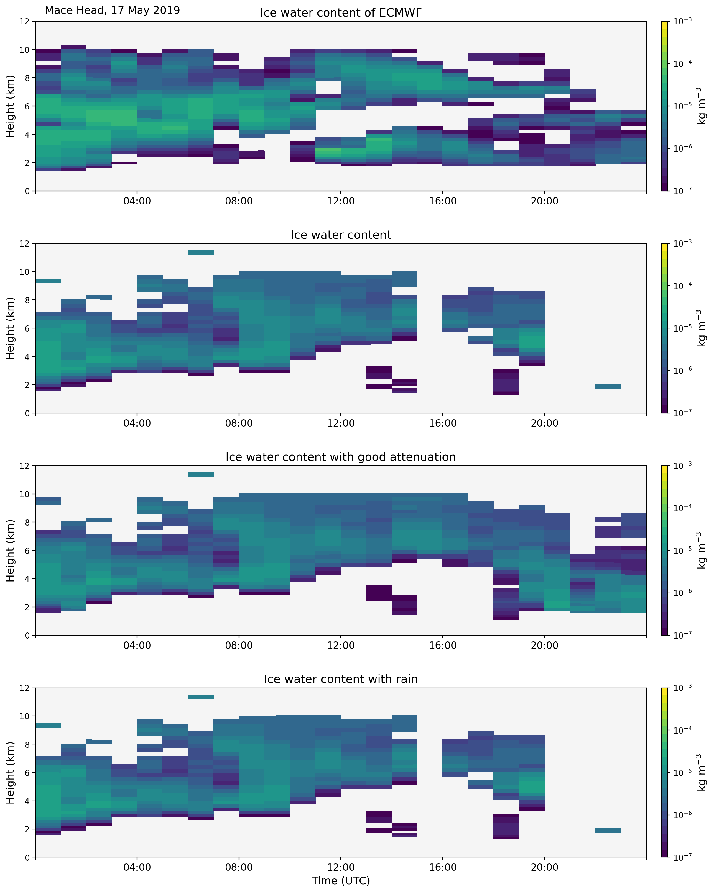
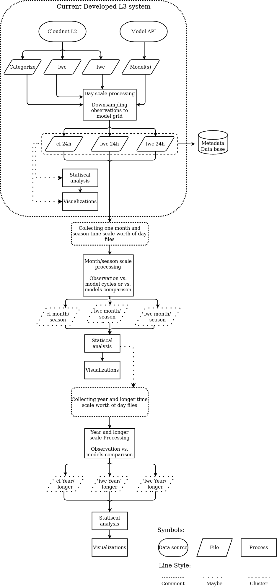

================
模式评估
================

CloudnetPy 具有正在进行中的模式评估功能。它旨在将 Cloudnet 观测产品与
来自各种模式的模拟产品联系起来并进行比较。该系统的主要目标是指出
不同模拟云变量的能力和不足。

模式评估分析将在多个不同的时间尺度上进行。最短且最重要的产品是
日尺度降采样产品。日尺度产品还不是模式评估产品，但日尺度是
创建观测和模式模拟之间评估分析的关键步骤。在软件开发的后期阶段，
还将基于日尺度产品创建月、季节、年和十年的时间长度。

云分数、冰水含量和液态水含量的模式评估日尺度处理链示例。

          Cloudnet L2 产品'分类'。它是使用 Cloudnet 分类位生成的。
          相同的位用于生成无法观测的'观测'云分数。
          云分数是模式的后处理变量。

          Cloudnet L2 产品'冰水含量'。模式不产生完全相同的变量，
          而是网格点处的冰的混合比。
          可比较的产品是使用模式的温度、压力和湿度计算的。

.. figure:: _figs/20190517_mace-head_lwc-scaled-adiabatic.png
          :width: 500 px
          :align: center

          Cloudnet L2 产品'液态水含量'。模式不产生完全相同的变量，
          而是网格点处的液体的混合比。
          可比较的产品是使用模式的温度、压力和湿度计算的。

观测产品的时间-高度网格总是比模式的网格更密集，因此
观测数据通过平均降采样以与模式网格大小相同。
降采样的观测和模拟是 L3 日尺度产品。

L3 日产品示例：云分数、IWC 和 LWC 的模式模拟与降采样观测比较。

.. figure:: _figs/20190517_mace-head_cf_ecmwf_group.png
          :width: 500 px
          :align: center

          观测和模拟的云分数。使用的模式为 ECMWF。

          观测和模拟的 IWC。使用的模式为 ECMWF。

.. figure:: _figs/20190517_mace-head_lwc_ecmwf_group.png
          :width: 500 px
          :align: center

          观测和模拟的 LWC。使用的模式为 ECMWF。

为了确保最合适的观测降采样版本，有几个特定产品的版本。
对于所有产品，都有降采样到高度-平流时间网格版本。
对于云分数，有几种不同的生成观测的方法，也有高层云过滤版本。
对于 IWC，有不同的掩码版本。

模式评估工作流程图示例

另见：

- Cloudnet 数据门户：https://cloudnet.fmi.fi/
- ACTRIS 主页：http://actris.eu/
- ACTRIS 数据门户：http://actris.nilu.no/
